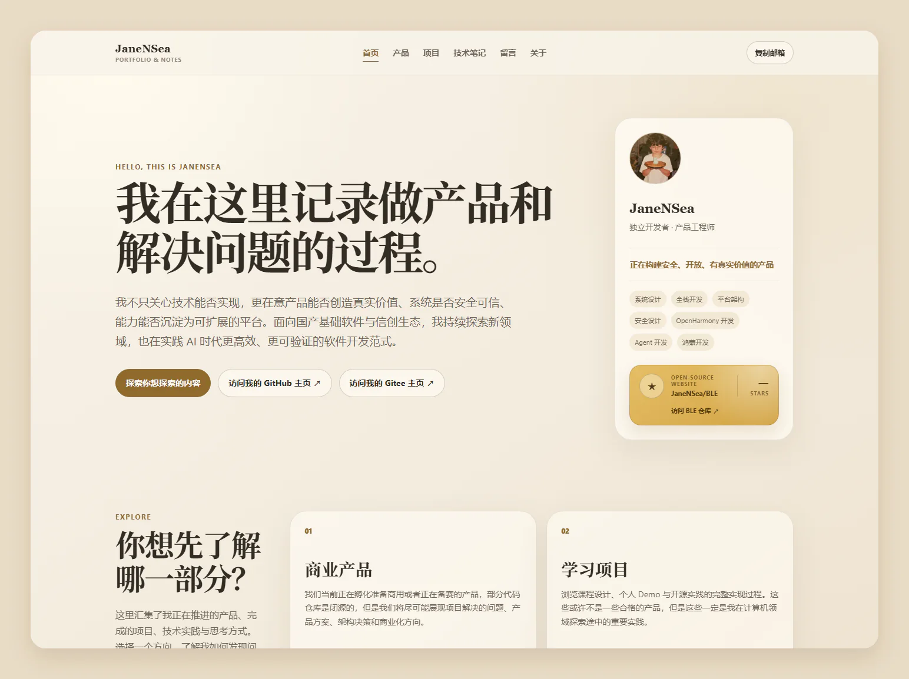
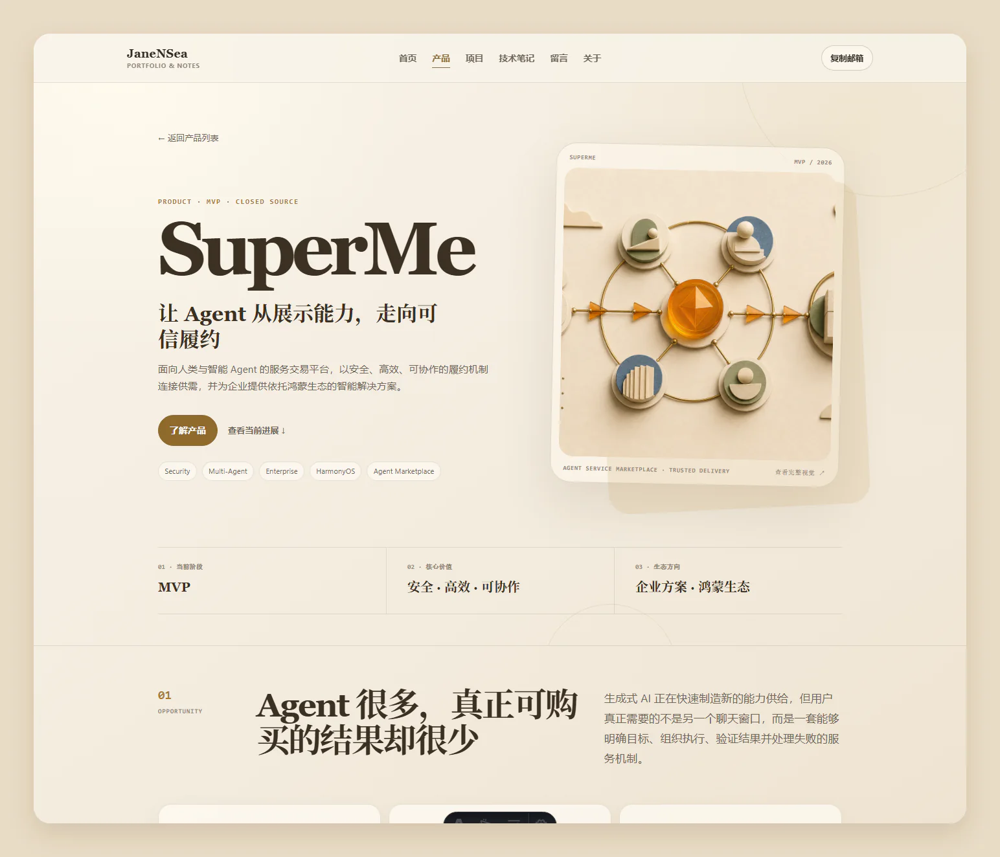
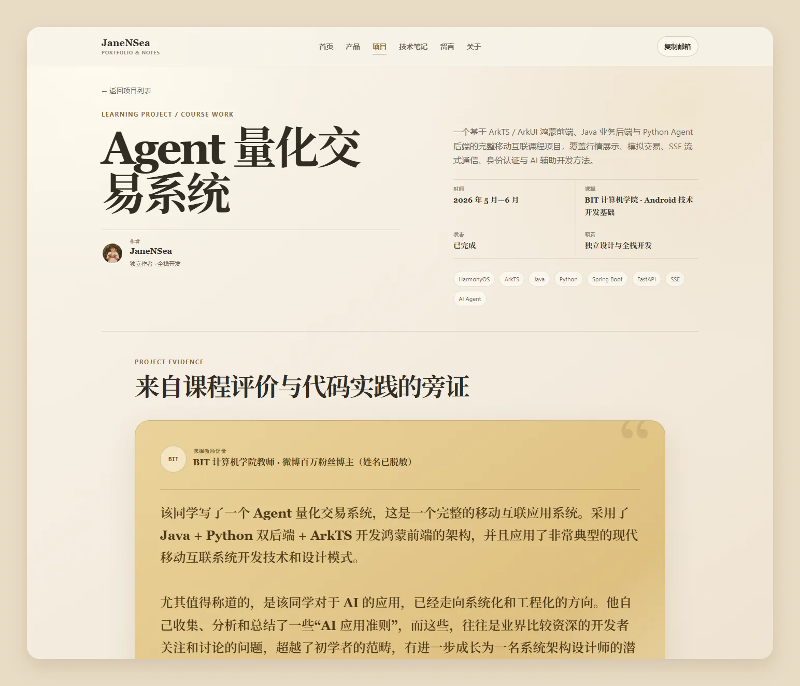

<p align="center">
  
</p>

<h1 align="center">JaneNSea · Portfolio & Notes</h1>

<p align="center">
  <strong>做产品，写代码，也记录每一次判断如何发生。</strong>
</p>

<p align="center">
  面向面试官、投资人、比赛评委与同行者的个人技术品牌站。<br />
  关注真实产品价值、安全可信、平台化能力、国产基础软件生态，以及 AI 时代的软件开发新范式。
</p>

<p align="center">
  <a href="https://janensea.github.io/BLE/">在线访问</a>
  · <a href="https://janensea.github.io/BLE/products/superme/">重点产品</a>
  · <a href="https://janensea.github.io/BLE/projects/">学习项目</a>
  · <a href="https://janensea.github.io/BLE/notes/">技术笔记</a>
</p>

<p align="center">
  
  
  
  <a href="./LICENSE"></a>
</p>

<p align="center">
  <a href="https://janensea.github.io/BLE/">
    
  </a>
</p>

## 这不是一条按时间排列的博客信息流

首页是一份经过策展的能力证明。它先给出商业产品、学习项目、技术笔记和个人原则四个清晰入口，再呈现最值得被看到的内容。

- **商业产品**：展示闭源产品能够公开的问题、方案、架构判断与市场方向。
- **学习项目**：记录课程设计、技术实验、个人职责、踩坑过程与复盘结论。
- **技术笔记**：围绕单一工程问题给出短、准、有边界的解决方案。
- **个人原则**：说明技术选择背后的产品判断，而不只罗列工具和关键词。

网站使用暖米色纸张背景、克制的琥珀色强调、衬线标题与轻量动效，避免把个人作品集做成另一块深色数据大屏。所有核心入口都支持键盘访问，并尊重 `prefers-reduced-motion`。

## 一件正在被孵化的产品

SuperMe 是目前最重要的商业产品案例：一个面向人类与智能 Agent 的服务交易平台，以安全、高效、可协作的履约机制连接供需，并优先探索 HarmonyOS / OpenHarmony 生态中的产品部署与企业解决方案。

<p align="center">
  <a href="https://janensea.github.io/BLE/products/superme/">
    
  </a>
</p>

产品页不是技术博客的放大版。它用产品叙事串联用户问题、核心价值、协同履约、可信交易、企业方案、鸿蒙生态与市场路径；技术图只用于证明设计判断，并明确区分已实现、正在完善和规划能力。

## 一份完整的学习过程

学习项目拥有独立于商业产品的表达方式：封面、作者、课程信息、教师评价、前后端仓库、章节目录与完整报告都由内容数据驱动。

<p align="center">
  <a href="https://janensea.github.io/BLE/projects/agent-quant-trading-system/">
    
  </a>
</p>

当前代表项目是基于 ArkTS / ArkUI 鸿蒙前端、Java 业务后端与 Python Agent 后端完成的移动互联课程设计。它保留完整技术报告，同时通过目录和信息层级让长文依旧可读。

## 我关心什么

### 产品价值

技术不是目的。首先确认真实需求、使用者、约束和验收方式，再决定系统应该做什么以及做到什么程度。

### 安全可信

安全不是上线前补的一层配置，而是身份、权限、幂等、审计、数据最小化与失败处理共同构成的产品边界。网站不会在客户端保存 GitHub Token，闭源项目也只公开脱敏后的信息。

### 平台化能力

一次交付解决一次问题，平台能力则让经验可以复用。无论是 SuperMe 的 Agent 服务与可信履约，还是本站的内容集合、动态路由和可复用布局，都强调清晰边界与持续扩展。

### 国产基础软件与信创生态

主动关注 HarmonyOS、OpenHarmony、仓颉、EulerOS、openGauss 等国产技术生态。选择它们不只是替换名词，而是理解新的端云协同、系统能力与自主可控边界。

### AI 与时代变化

拥抱 AI 带来的开发效率，也坚持人为主导架构、分块生成、持续验证和责任可追踪。AI 可以扩大探索边界，但不能替代关键判断、安全责任与工程质量。

## 技术与架构

| 关注点 | 实现 |
| --- | --- |
| 内容站点 | Astro 7、TypeScript、Markdown / MDX、原生 CSS |
| 内容模型 | Astro Content Collections + Zod Schema |
| 页面生成 | 静态路由、动态内容详情页、GitHub Pages `base` 兼容 |
| 视觉系统 | 全局 Design Tokens、暖色编辑风格、响应式布局 |
| 交互 | 原生 JavaScript、堆叠项目轮播、仓库 Star 数、邮箱复制 |
| 留言 | Utterances + GitHub Issues |
| 部署 | GitHub Actions + GitHub Pages |

```text
src/
├─ components/        可复用卡片、内容模块与站点组件
├─ content/
│  ├─ products/       商业产品与闭源案例
│  ├─ projects/       课程设计、Demo 与学习项目
│  ├─ notes/          聚焦单一问题的技术文章
│  └─ principles/     产品与工程判断原则
├─ data/site.ts       身份、导航、联系信息与仓库配置
├─ layouts/           产品、项目、文章等页面骨架
├─ pages/             路由与内容组合
└─ styles/            全局 Token 与 Markdown 样式
```

内容选择和排序位于 `src/utils/content.ts`，Schema 位于 `src/content.config.ts`。新增内容不需要把单个项目硬编码进页面。

## 开始使用

### 环境要求

- Node.js `>= 24`
- npm

```bash
git clone https://github.com/JaneNSea/BLE.git
cd BLE
npm install
npm run dev
```

浏览器访问 `http://localhost:4321/BLE/`。

Windows PowerShell 如果阻止执行 `npm.ps1`，使用：

```powershell
npm.cmd install
npm.cmd run dev
```

提交或部署前执行：

```bash
npm run check
npm run build
```

## 把它改成你的个人站点

### 1. 修改身份与链接

编辑 `src/data/site.ts`：

```ts
export const site = {
  name: 'YourName',
  role: '你的角色',
  description: '你关注的问题与价值主张',
  email: 'you@example.com',
  avatar: '/avatar.jpg',
  social: {
    github: 'https://github.com/your-name',
    gitcode: 'https://gitcode.com/your-name',
  },
  repository: {
    slug: 'your-name/your-repo',
    url: 'https://github.com/your-name/your-repo',
    api: 'https://api.github.com/repos/your-name/your-repo',
  },
};
```

将头像放到 `public/avatar.jpg`。网站图标与头像是两套独立资源，替换头像不会修改站点图标。

### 2. 调整品牌视觉

全局颜色、字体、间距、圆角和阴影位于 `src/styles/tokens.css`。优先修改 Token，不要在组件中复制大量一次性颜色。

### 3. 配置站点地址

项目型 GitHub Pages：

```js
export default defineConfig({
  site: 'https://your-name.github.io',
  base: '/your-repo',
});
```

如果仓库名是 `your-name.github.io`，通常可以将 `base` 设为 `/`。站内链接统一通过 `withBase()` 生成。

## 添加内容

### 技术笔记

```bash
npm run new:note -- ble-connection-timeout
```

在生成的 `src/content/notes/ble-connection-timeout.md` 中填写：

```yaml
---
title: "BLE 重连为什么会进入假连接状态"
summary: "说明问题、触发条件和最终解法。"
publishedAt: 2026-08-02
tags: ["BLE", "State Machine"]
listingTags: ["前端", "TypeScript"]
featured: true
priority: 30
draft: false
readingMinutes: 6
---
```

`tags` 用于详细页，可填写具体框架、协议和技术概念；`listingTags` 只用于列表卡片与筛选，建议保留“开发方向 + 编程语言”，例如 `前端 + TypeScript` 或 `嵌入式 + C`。短文章推荐使用 Markdown，并保持“问题 → 原因 → 解法 → 边界”的结构。Codex 跨会话录入技术文档时必须遵循 [`docs/CODEX_TECHNICAL_NOTE_GUIDE.md`](./docs/CODEX_TECHNICAL_NOTE_GUIDE.md)。

### 学习项目

```bash
npm run new:project -- agent-quant-trading
```

学习项目可以记录多人作者、课程评价和多个代码仓库：

```yaml
---
title: "项目名称"
summary: "项目解决的问题和最终产出。"
cover: "/images/projects/project-name/cover.webp"
type: "course"
status: "completed"
role: "独立设计与全栈开发"
year: 2026
period: "2026 年 5 月—6 月"
course: "课程名称"
authors:
  - name: "YourName"
    role: "独立作者"
    avatar: "/avatar.jpg"
repositories:
  - label: "前端仓库"
    stack: "ArkTS · ArkUI"
    url: "https://github.com/your-name/frontend"
testimonial:
  quote: "课程教师评价"
  attribution: "评价者公开身份"
---
```

仓库还未公开时省略 `url`，页面会显示“即将公开”。

### 商业产品

```bash
npm run new:product -- product-codename
```

商业产品建议使用 MDX，将公开图片放到 `public/images/products/<slug>/`，并复用：

- `ProductSection.astro`：产品叙事章节。
- `CaseImage.astro`：宽幅产品图或架构图。
- `CaseGrid.astro`：价值、决策、阶段或商业模式。
- `ProcessFlow.astro`：履约链路与流程。
- `CaseCallout.astro`：产品命题与关键判断。

闭源案例只发布脱敏架构、公开截图、经过验证的结论和明确标注的规划，不要提交密钥、客户数据、私有仓库地址或保密算法。

`featured` 控制首页精选，`priority` 控制策展顺序，未完成内容使用 `draft: true`。

## GitHub Pages 部署

仓库已经提供 `.github/workflows/deploy-pages.yml`：

1. 在 `astro.config.mjs` 配置正确的 `site` 与 `base`。
2. 将代码推送到 `main` 分支。
3. 打开 GitHub 仓库的 **Settings → Pages**。
4. 将 **Build and deployment → Source** 选择为 **GitHub Actions**。
5. 重新运行 `Deploy to GitHub Pages` 工作流。

部署成功后，项目型站点地址为：

```text
https://<username>.github.io/<repository>/
```

如果 `actions/deploy-pages` 返回 `404 Not Found`，通常是 Pages 尚未启用，或发布源没有选择 GitHub Actions。

## Star 与留言板

首页通过 GitHub 公共仓库 API 获取 Star 数，并在浏览器中缓存十分钟。Star 操作会进入 GitHub 的登录界面；前端不会嵌入 GitHub Token。

留言页使用 Utterances 将评论公开保存到 GitHub Issues：

1. 确保仓库公开且已开启 Issues。
2. 安装 [Utterances GitHub App](https://github.com/apps/utterances)。
3. 授权当前仓库。
4. 重新部署网站。

评论者需要登录 GitHub。页面同时保留直接访问 Issues 的备用入口。

## License

代码以 [MIT License](./LICENSE) 开源。你可以使用、修改、复制和分发，但需要保留许可证与版权声明。

站点中展示的个人文字、头像、产品资料和第三方内容不因代码许可证而自动获得额外授权；复用时请替换为你自己的内容，并尊重原始权利归属。

---

<p align="center">
  Built with Astro · Designed and maintained by <a href="https://github.com/JaneNSea">JaneNSea</a>
</p>
